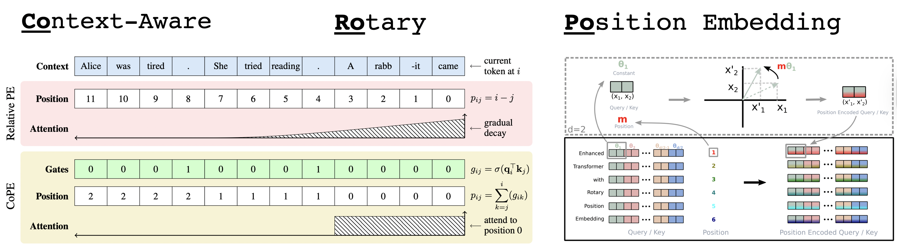
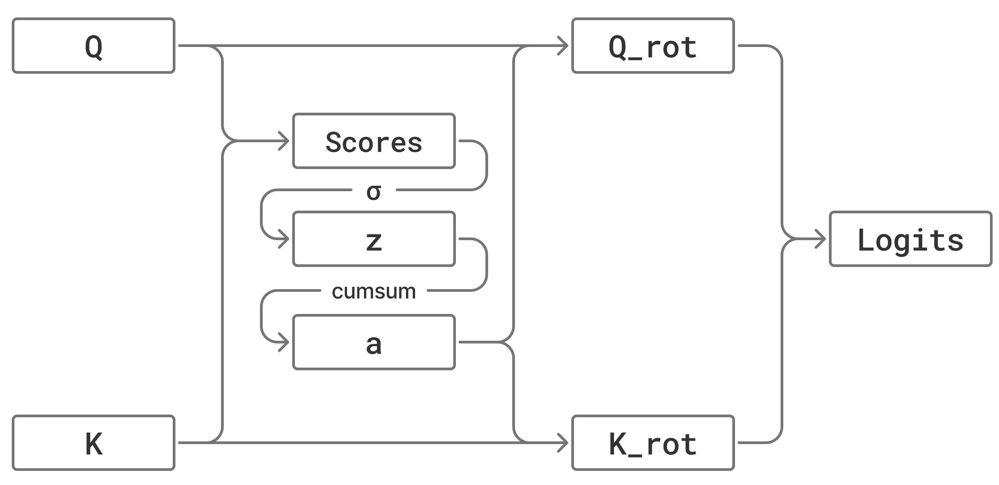
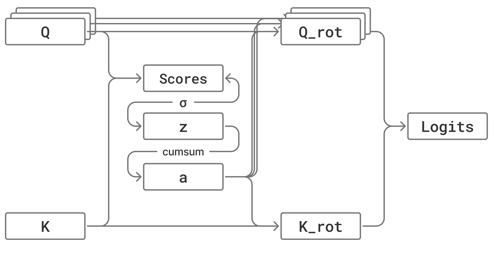

# RoPE-CoRoPE

This repository presents a comprehensive exploration of **efficient positional embeddings** in modern attention mechanisms using **OpenAI Triton**. It features two core components: 
- a high-performance **Fused RoPE kernel** integrated into Flash Attention
=
- and an experimental implementation of **Co-RoPE**, which is a context-aware improvement of RoPE.

## Fused RoPE

### Algorithm

**Rotary Positional Embedding (RoPE)** encodes absolute positional information by rotating the query and key vectors in a high-dimensional space. Given a position $m$ and a vector $\mathbf{x}(\mathbf{q} \text{ or } \mathbf{k})$, the rotation is defined as:
$$f(\mathbf{x}, m) = \begin{pmatrix} x_1 \\ x_2 \\ \vdots \\ x_d \end{pmatrix} \otimes \begin{pmatrix} \cos m\theta_1 \\ \cos m\theta_1 \\ \vdots \\ \cos m\theta_{d/2} \end{pmatrix} + \begin{pmatrix} -x_2 \\ x_1 \\ \vdots \\ -x_{d-1} \end{pmatrix} \otimes \begin{pmatrix} \sin m\theta_1 \\ \sin m\theta_1 \\ \vdots \\ \sin m\theta_{d/2} \end{pmatrix}$$

> [Note] In code implementation(like `transformers`), we often use half layout instead of interleaved layout, which is more efficient for GPU operations.

### Triton Kernel Optimization


## Co-RoPE(Experimental)
Co-RoPE is a context-aware improvement of RoPE. In this project, we implement the Co-RoPE in Triton and compare the performance with the PyTorch implementation.

### Preliminaries

- RoPE: https://arxiv.org/abs/2104.09864


- CoPE: https://arxiv.org/abs/2405.18719



### Our Methodology

Co-RoPE extends RoPE by introducing context-aware mileage computation. The key mathematical formulation is as follows:

**Co-RoPE** 



For each query position $i$ and key position $j$, we compute the contextual mileage by summing up the sigmoid of the dot product between the query head and the key head:

$$z_{ij} = \sigma(\mathbf{q}_i \cdot \mathbf{k}_j \cdot s)$$

and the accumulated mileage is:

$$a_{ij} = \sum_{k=0}^{j} z_{ik}$$

where $\sigma$ is the sigmoid function, $s$ is the scaling factor, and $\mathbf{q}$ represents the query head. So the relative displacement between positions $i$ and $j$ is:

$$\Delta a_{ij} = a_{ii} - a_{ij}$$

This captures the contextual distance between query position $i$ and key position $j$.

The phase angle is computed as:

$$\phi_{ijd} = \Delta a_{ij} \cdot \omega_d$$

where $\omega_d = \frac{1}{\theta^{2d/D}}$ is the inverse frequency for dimension $d$, and $\theta$ is the RoPE base (typically 10000).


**Efficient Rotation**

To efficiently apply the rotation, we decompose the query and key vectors into two halves:

$$\mathbf{q} = [\mathbf{q}_1, \mathbf{q}_2], \quad \mathbf{k} = [\mathbf{k}_1, \mathbf{k}_2]$$

The energy fields are computed as:

$$E_A = \mathbf{q}_1 \mathbf{k}_1^T + \mathbf{q}_2 \mathbf{k}_2^T$$

$$E_B = \mathbf{q}_2 \mathbf{k}_1^T - \mathbf{q}_1 \mathbf{k}_2^T$$

The final attention score combines the energy fields with phase modulation:

$$\text{score}_{ij} = \sum_{d=0}^{D/2-1} \left[ E_A^{ijd} \cos(\phi_{ijd}) - E_B^{ijd} \sin(\phi_{ijd}) \right] \cdot s$$

**CoRoPE-GQA**

we use GQA to implement the Co-RoPE, to reduce the computational cost of the Co-RoPE.




We use a leader head to compute the contextual mileage and the accumulated mileage, and then broadcast the mileage to all the heads in the group.

### Triton Kernel Optimization

From Flash Attention v2(https://triton-lang.org/main/getting-started/tutorials/06-fused-attention.html).

We start from the Triton kernel of Flash Attention v2, and then modify it to implement the Co-RoPE.

1. GQA implementation

2. Fwd Kernel Optimization
"加法定理手术刀"

3. Bwd Kernel Optimization


### Performance Benchmark
On Nvidia H200


*Foward Pass*
| |FLOPS| TIME|
|---|---|---|
||1000|100|
||1000|100|


*Backward Pass*
| |FLOPS| TIME|
|---|---|---|
||1000|100|
||1000|100|


## Environment:
```
PyTorch: 2.9.1+cu128
CUDA Version: 12.8
GPU: NVIDIA H200
Triton: 3.5.1
NumPy: 2.3.5
einops: 0.8.1
flash-attn: 2.8.3
transformers: 4.57.3
```
Install Env:
```bash
conda create -n corope python==3.12
conda activate corope
pip install torch triton
#use flash-attn as comparison
pip install packaging ninja psutil
pip install flash-attn --no-build-isolation
pip install transformers
```